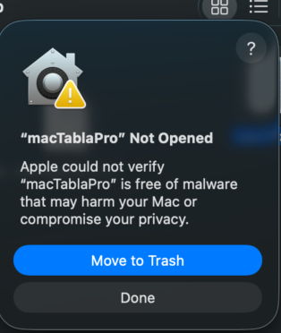
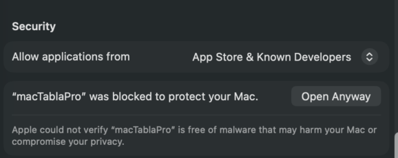
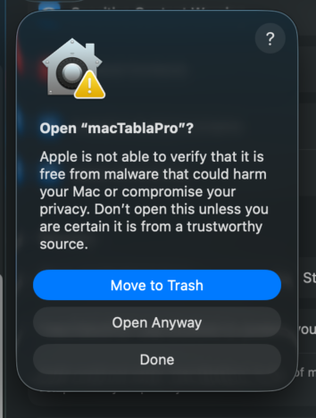
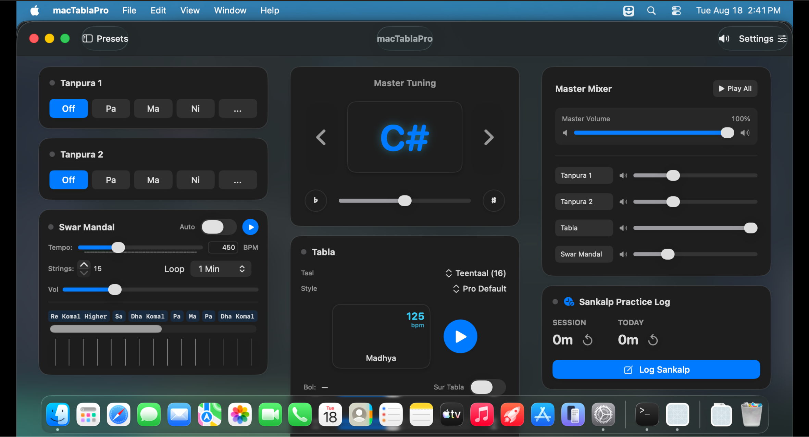

# macTablaPro

> **A native, zero-latency classical Indian music accompaniment workstation for macOS.**
> Crafted with SwiftUI, CoreAudio DSP, and modern macOS design.
> Inspired by Prasad Upasani's *iTablaPro*

---

## Overview

**macTablaPro** brings the complete Indian classical accompaniment experience to the Mac desktop. Designed for vocalists, instrumentalists, music teachers, and students doing daily *riyaaz* (practice), it integrates authentic **Tabla accompaniment**, **Dual Tanpuras**, a **Swar Mandal (harp/zither)**, microtonal **Master Pitch & Studio Mixer**, and an integrated **Sankalp Practice Tracker** into a responsive zero-scroll workstation.

---

## ✨ Features at a Glance

### 🥁 Tabla Accompaniment Engine

- **Rich Taal Library**: Authentic presets covering Teentaal, Ektaal, Jhaptaal, Bhajani, and many more, with rich variations and laya-based stroke patterms.
- **Live Visual Display**: High-contrast LED display showing active Matras (beats), bols (syllables), and quarter-matra metronome subdivision indicators.
- **Real-Time Tempo & Pitch**: Smooth tempo slider, tap tempo tracker, multiplier controls, and micro-timing compensation.

### 🎼 Swar Mandal (Raag Harp / Zither)

- **Interactive Strumming**: Strum across virtual strings with continuous hover/mouse-down interaction or trigger automatic loops.
- **Customizable Scales**: Tune individual strings to match any Indian classical raag (scale).
- **Tempo Control**: Smooth continuous strumming speed control (300–800 BPM).

### 🎛️ Master Pitch & Channel Strip Mixer

- **Global Sa Reference**: Transpose all instruments simultaneously across Western notes (A2 through E4) with fine-tuning in cent increments (±100 cents).
- **Channel-Strip Mixing**: Dedicated sub-mixers for Tabla, Tanpura 1, Tanpura 2, and Swar Mandal with gain sliders and instant mute buttons.
- **Master Transport**: One-click global start/stop and master volume control with zero audio clipping.

### 🎚️ Acoustic Instrument Tuner & Pitch Detector

- **Real-Time Microphone Pitch Detection**: Listen to acoustic harmoniums, sitars, or vocalists with harmonic-resistant autocorrelation DSP.
- **Precision Analog Cents Gauge**: High-resolution ±50¢ needle meter with dynamic color coding (≤ ±3¢ green in-tune indicator).
- **One-Click Pitch Capture**: Instantly transfers the detected acoustic note and cent offset to the internal Tanpura and Master Pitch engine.
- **Octave Transposition**: Intuitive 8va / 8vb octave switching for dual-octave ranges (A … E).

### ⏱️ Sankalp Practice Tracker

- **Integrated Riyaaz Timer**: Automatically measures active practice time while accompaniment is playing.
- **Optional Form Integration**: Connect practice logs to Google Forms for study tracking or sharing with your guru/teacher.
  > [!NOTE] This feature is currently only supported within Mahesh Kale School of Music.

### 💾 Presets & iTablaPro Compatibility

- Save and recall custom instrument configurations, tempos, pitches, and taal settings.
- Import and export presets compatible with standard **iTablaPro** configurations.

### 🎨 macOS-Native Visual Themes

- **Modern Liquid Glass**: Clean, translucent macOS look with blur backgrounds.
- **Vintage / Antique Mode**: Warm parchment aesthetic with classical typography and styling.

---

## 📥 Installation Guide

### Option 1: Standard Installation (No Terminal Required)

This method is recommended for musicians, vocalists, and non-technical users:

1. Go to the **[Releases](https://github.com/kidkoder432/macTablaPro/releases)** page on GitHub.
2. Download the latest `macTablaPro-v0.9.0-beta.zip` archive.
3. Double-click the downloaded `.zip` file to extract `macTablaPro.app`.
4. Drag `macTablaPro.app` into your **Applications** folder (`/Applications`).
5. Double-click `macTablaPro.app` to open.

## Bypassing macOS Gatekeeper

When you first open the app, you will see a warning like this:


To bypass this warning and run the app:
1. Go to System Settings > Security & Privacy
2. Scroll down to the **Security** section
   
3. Click "Open Anyway." A dialog will pop up
   
4. Confirm by clicking "Open Anyway" and type your password (or use Touch ID if available)
   
5. **Congratulations! macTablaPro should now be installed!**
   

> [!NOTE] You only need to do this *once*; macTablaPro will launch without a warning in the future. However, if you install a new version of the app, you may need to complete these steps again. 


## 🛠️ Building from Source

If you want to contribute or build `macTablaPro` locally:

### Prerequisites

- **macOS 13.0 (Ventura)** or later
- **Xcode 15.0+** with Swift 6.0 support
- Apple Silicon (M1/M2/M3/M4) or Intel Mac

### Build in Xcode

1. Clone the repository:
   ```bash
   git clone https://github.com/kidkoder432/macTablaPro.git
   cd macTablaPro
   ```
2. Open `macTablaPro.xcodeproj` in Xcode:
   ```bash
   open macTablaPro.xcodeproj
   ```
3. Select the `macTablaPro` scheme and press `Cmd + R` to build and run.

### Build via Command Line

Run the automated release packaging script:

```bash
./export_app.sh
```

This builds an ad-hoc signed Release bundle and packages `macTablaPro.zip` to your Desktop.

---

## 🤖 Development Philosophy & AI Attribution

Transparency and honesty are core principles of this project.

- **Musical & Architectural Direction**: The entire conceptual design, Indian classical music domain specifications (Taal structures, bol sequences, microtonal Sa frequencies, Tanpura string models, Swar Mandal scales), UI/UX workflows, and audio timing requirements were defined, guided, and curated through human domain expertise.
- **Code Implementation**: The vast majority of the Swift and SwiftUI codebase, DSP voice-pool infrastructure, and boilerplate code was written collaboratively with AI coding assistants (Google Antigravity & Gemini) under direct and iterative human prompt engineering, testing, and review.

We believe that being honest about the role of AI in modern software creation fosters trust, encourages open experimentation, and highlights how domain knowledge and AI pairing can bring niche, high-craft creative tools to life.

*Made with dedication for Indian Classical Music practitioners everywhere.*
