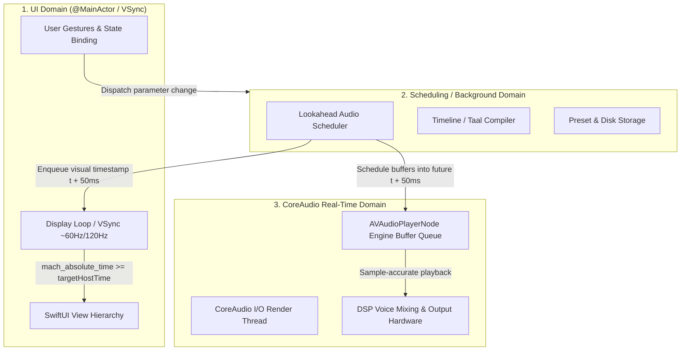

# Module 1: The 3 Threading Domains of Real-Time Audio in macOS

In a professional macOS audio application, concurrency cannot be treated as a single pool of threads or simple `Task` blocks. Doing so results in **priority inversion**, **audio glitching (buffer underruns)**, and **visual phase desynchronization**.

An audio application must be architected around **three strictly decoupled domains**, each with distinct timing constraints and concurrency guarantees.

---

## The Three Domains

---

## Domain Breakdown & Invariants

### 1. The CoreAudio Real-Time Domain (The "No-Fly Zone")
- **Execution Context**: Driven by the hardware audio interrupt / CoreAudio I/O thread.
- **Priority**: Highest real-time thread priority on macOS (SCHED_FIFO / Mach real-time constraint thread).
- **Strict Invariants**:
  1. **Zero dynamic memory allocation** (`malloc`, Swift class instantiations, string manipulation, array resizing).
  2. **Zero blocking locks** (`NSLock`, `pthread_mutex`, Swift actor await, semaphores). Priority inversion occurs if a low-priority thread holds a lock the audio thread needs.
  3. **Zero file or network I/O**.
  4. **Zero Objective-C runtime / Swift runtime dynamic dispatch or ARC retain/release churn**.

### 2. The Scheduling & Coordination Domain
- **Execution Context**: High-priority background thread / dedicated actor or GCD queue.
- **Role**:
  - Executes ahead-of-time lookahead scheduling ($t + \Delta t$, e.g., 50ms ahead).
  - Queries timelines, translates subdivisions into sample offsets or `mach_absolute_time` ticks.
  - Submits pre-allocated audio buffers to `AVAudioPlayerNode` / AudioUnit queues.
  - Submits visual event timestamps to the UI presentation queue.
- **Rules**:
  - Must NOT run on `@MainActor` (any UI gesture or heavy view render would starve the scheduler and drop audio beats).
  - Must NOT perform heavy on-the-fly resampling or parsing during tick callbacks.

### 3. The UI / Presentation Domain (`@MainActor`)
- **Execution Context**: macOS Main Thread (`@MainActor`), synchronized to the display refresh rate via `CVDisplayLink` / `CADisplayLink`.
- **Role**:
  - Renders the UI at 60Hz or 120Hz (ProMotion).
  - Handles user interactions (touching sliders, clicking buttons, selecting Taals).
  - Consumes visual events **at the exact hardware time the audio exits the speakers**.
- **Rules**:
  - Must never perform audio calculations or synchronous timeline compilation.
  - Must only read presentation state when `mach_absolute_time() >= event.targetHostTime`.

---

## Technical Debt in Current Codebase

| Problem in Current Code | Why It Fails | Domain Violated |
| :--- | :--- | :--- |
| `LookaheadAudioScheduler` is `@MainActor` running `Task { @MainActor in ... }` with `Task.sleep` | Scheduler yields to UI gestures, window resizes, and SwiftUI renders, causing audio stutters. | Violates separation of Scheduling vs UI Domain. |
| `executeSequenceTick` sets `currentMatra` and `currentBolName` at lookahead time | UI changes 50ms–100ms before sound reaches physical speakers. | Violates Presentation Synchronization. |
| Multiple lookahead ticks fire in one `Task` iteration | Bol state changes get overwritten multiple times before a single frame renders, causing LED bol skipping and jitter. | Violates Frame Cadence. |
| `OfflineAudioResampler.resample` called inside `voicePool.play` | Allocates PCM buffers and converters during playback ticks. | Violates Real-time Allocation rules. |
| `VoicePool` and `AudioVoice` use `NSLock` spanning CoreAudio completion handlers and MainActor | CoreAudio completion blocks lock against `@MainActor`, leading to priority inversion risk. | Violates Non-blocking Audio rules. |

---

## Architectural Challenges to Reason Through

1. **How should the Scheduler and the UI communicate without locks or `@MainActor` blocking?**
2. **How does a display-locked loop (e.g. `CVDisplayLink` or high-resolution timer) sample queued visual events at frame boundaries?**
3. **When the user changes Taal or Tempo in the UI, how is that intent cleanly handed off to the Scheduler without micro-stuttering active audio?**
