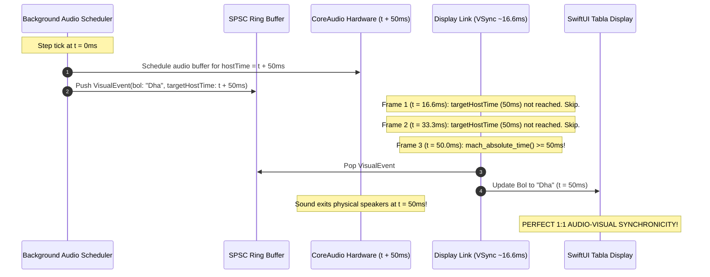

# Module 3: Rocket Telemetry to Audio/Display Sync — The Lock-Free Ring Buffer

Your intuition from your rocket project is **100% spot-on**. In fact, real-time audio systems and high-reliability aerospace telemetry use the exact same foundational architecture: **The Single-Producer Single-Consumer (SPSC) Lock-Free Ring Buffer**.

---

## 1. Why UI Actions Chop the Attack of Audio Samples

Before looking at the ring buffer, let's understand why your audio was losing its sharp attacks when you touched the UI:

```
[Main Thread (@MainActor)]
   │
   ├─ User clicks / drags a slider (Mouse Tracking Loop blocks MainActor for 40ms)
   │   │
   │   ▼
   │  LookaheadAudioScheduler cannot run! (It is waiting for MainActor to be free)
   │
   ├─ Slider released! MainActor finally wakes up the Scheduler.
   │
   ▼
LookaheadAudioScheduler: "I need to schedule sample for T = 100.0s."
CoreAudio Hardware Clock: "Too late! It is already T = 100.03s! 
                           The attack transient at 100.0s is in the past, so I must drop it."
                           💥 Result: Chopped attack or silent note!
```

### The Fix:
The **Audio Scheduler must NOT live on `@MainActor`**. It must live on a **high-priority background thread/actor** that runs continuously without caring what the user is doing with their mouse or window.

---

## 2. The SPSC Ring Buffer Architecture

Now that the Scheduler is on a background thread, how does it tell the UI what bol to display?

```
+─────────────────────────────────────────────────────────────────────────────+
|                         SPSC Visual Ring Buffer                             |
|                                                                             |
|   Index:     [ 0 ]         [ 1 ]         [ 2 ]         [ 3 ]      ...       |
|   Data:   {Matra: 1,    {Matra: 1,    {Matra: 2,    [ Empty ]               |
|            Bol: "Dha",   Bol: "Dhin",  Bol: "Dha",                          |
|            Time: T1}     Time: T2}     Time: T3}                            |
|                                            ▲                                |
|              ▲                             │                                |
|              │                        Write Pointer                         |
|         Read Pointer                 (Audio Scheduler)                      |
|       (Display Loop)                                                        |
+─────────────────────────────────────────────────────────────────────────────+
```

### Why is it "Lock-Free"?
- **Only ONE thread writes**: The Audio Scheduler increments the `Write Pointer` when it pushes a new event.
- **Only ONE thread reads**: The Display Loop increments the `Read Pointer` when it consumes an event.
- Because the writer only writes to unread slots and updates an atomic index, and the reader only reads written slots, **neither thread ever has to lock or wait for the other**.

---

## 3. The Display Loop (V-Sync vs Timer)

In macOS, screens refresh at 60Hz (every 16.6ms) or 120Hz on ProMotion displays (every 8.3ms).

On every screen refresh cycle:
1. The display loop checks the head of the Ring Buffer (`Read Pointer`).
2. It asks: `Is mach_absolute_time() >= event.targetHostTime`?
   - **NO**: The sound has not exited the speakers yet. Do nothing this frame; leave the event in the buffer.
   - **YES**: The sound is exiting the physical speakers *right now*.
     - Pop the event off the ring buffer.
     - Update the display (`currentBol = event.bol`, `currentMatra = event.matra`).



---

## 4. Why Switching Taals / Variations Created Pops

When you change Taal in the UI:
1. `Tabla.activeTaal` changed immediately on the main thread while the audio loop was halfway through reading the previous Taal's timeline.
2. The scheduler suddenly looked for step index 12 in a new Taal that only had 6 steps, causing out-of-bounds or empty timeline queries.
3. Active voices that were currently vibrating were abruptly cut without a micro-fade or release envelope, causing a sharp DC step jump $\rightarrow$ **Audible Pop/Click**.

### The Solution:
1. **Atomic Timeline Swap**: When the user picks a new Taal/Style, compile the new timeline and queue it. The background scheduler swaps to the new timeline cleanly at the next Matra boundary (or next pulse).
2. **Clean Voice Stealing / Fade**: If a voice needs to be repurposed, fade or stop cleanly without DC offset discontinuities.

---

## 5. Summary of the Architecture We Need

1. **Move `LookaheadAudioScheduler` off `@MainActor`** $\rightarrow$ dedicated background concurrency domain.
2. **Build a lightweight `SPSCRingBuffer<VisualBeatEvent>`** between the scheduler and the UI.
3. **Add a Display Loop (`DisplayLink` / frame timer)** on the UI side that pops events at `targetHostTime`.
4. **Decouple Taal switching** into an atomic timeline pointer swap.
