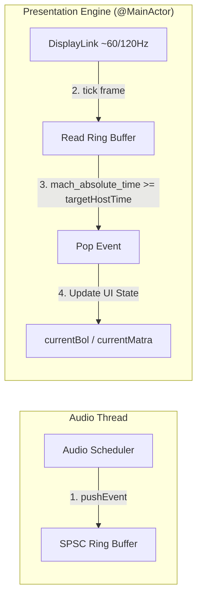

# Module 5: Swift Closures, Memory Capture & Designing the Presentation Engine

You raised two critical points:
1. **Building our own "CoreUI" (Presentation Engine)** to hold future events and fire them at the exact instant.
2. **What closures are, why they are everywhere, and why they cause threading bugs when misunderstood.**

---

## Part 1: What is a Swift Closure? (Demystified)

Think of a closure as a **backpack containing instructions + captured objects**:

```
Normal Function:
func add(a: Int, b: Int) -> Int { return a + b }

Closure (Anonymous Function):
let addClosure = { (a: Int, b: Int) -> Int in
    return a + b
}
```

### Why do closures exist?
Closures let you pass **actions as variables** to other systems.
For example, telling the audio hardware:
> *"When you finish playing this sound 2 seconds from now, run this closure to mark the voice as free."*

---

### The 3 Things That Cause Confusion with Closures

#### 1. Escaping Closures (`@escaping`)
- **Non-escaping**: The closure runs immediately inside the function and is thrown away before the function returns (like `array.map { ... }`).
- **Escaping (`@escaping`)**: The closure is saved into a variable or sent to a background thread to be run **later** in time.

#### 2. Variable Capture & `[weak self]` (Retain Cycles)
When a closure references a class object (`self.tempoBPM`), the closure **grabs a strong reference (holds onto `self` in memory)**.
If `self` owns the clock, and the clock owns the closure, and the closure owns `self`:
```
   [ Tabla ] ──(owns)──► [ Clock ] ──(owns)──► [ Closure ]
      ▲                                             │
      └──────────────────(owns self)────────────────┘
```
Neither will ever be freed from RAM! This is a **Memory Leak (Retain Cycle)**.
By writing `[weak self]`, you tell the closure: *"Don't hold onto me strongly. If I get deleted, turn into `nil`."*

#### 3. `@Sendable` (Thread Safety in Swift Concurrency)
If a closure is passed from the Main Thread to a Background Thread, Swift checks:
*"Is what this closure touches safe to share across threads?"*
A closure marked `@Sendable` promises that it won't access non-thread-safe variables across threads.

---

## Part 2: Designing Your "CoreUI" (Visual Presentation Engine)

Your idea of writing a dedicated presentation manager that holds future events and fires them at the exact instant is **the industry standard design for DAW / Sequencer UIs** (used by Logic Pro, Ableton, and FL Studio).

Let's call this component **`VisualPresentationEngine`**.

### How `VisualPresentationEngine` Works



### The Data Struct: `VisualBeatEvent`
A lightweight, value-type struct (no classes, no closures, no memory allocations):

```swift
struct VisualBeatEvent: Sendable {
    let matra: Int
    let subStep: Int
    let bolName: String
    let taalSymbol: String
    let targetHostTime: UInt64
}
```

### The Reader Loop (DisplayLink)
Instead of a closure running in the scheduler, the `VisualPresentationEngine` runs on the display refresh loop:
1. Every frame (~16.6ms at 60Hz or ~8.3ms on ProMotion):
2. Look at the head of the ring buffer.
3. If `mach_absolute_time() >= event.targetHostTime`:
   - Pop the event.
   - Update the UI properties.
4. If not, do nothing and wait for the next frame.

---

## Part 3: Why This Eliminates Spaghetti Code

In your current code:
- `Tabla.swift` tries to do **everything**: calculate timing, play audio, resample samples, update `@Published` variables for SwiftUI, handle dropdown menus, and parse CSV files.

In the clean decoupled architecture:
1. **`LookaheadAudioScheduler`** (Background): Just counts host ticks and triggers audio buffers + pushes visual events.
2. **`VisualPresentationEngine`** (UI / MainActor): Just watches the ring buffer and syncs the screen to `mach_absolute_time()`.
3. **`Tabla`** (Domain Model): Just holds the active state (BPM, Taal) and resolves timelines.

---

## Next Step: Let's Design the SPSC Ring Buffer Together

A Single-Producer Single-Consumer (SPSC) Ring Buffer is an array of fixed size (e.g. 64 slots) with two integer pointers:
- `writeIndex: UInt32` (Only the Audio Scheduler modifies this)
- `readIndex: UInt32` (Only the Presentation Engine modifies this)

Let's reason through the 3 edge cases:
1. When is the buffer **Empty**?
2. When is the buffer **Full**?
3. How do we wrap around when index reaches the end of the array without using expensive modulo `%` operators?
