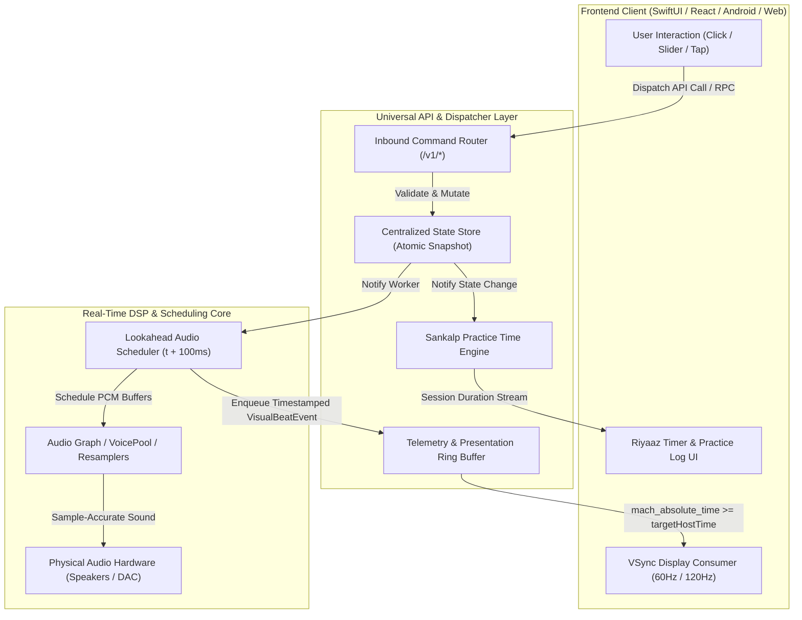

# macTablaPro Core Engine: Official API Reference & State Machine Protocol

> **Specification Version**: `1.0.0-draft`  
> **Target Architecture**: Universal Cross-Platform Audio Engine (Swift / C++ / WASM / JSON-RPC)  
> **Source Base**: [`macTablaPro`](file:///Users/findp/Documents/macTablaPro)

---

## 1. Architectural Architecture & State Flow

The engine decouples **Inbound Control Commands** (from any UI client) from **Outbound Visual Presentation Buffers** (driven by the audio clock).



---

## 2. Initialization API & Engine Lifecycle (`/v1/init`)

The engine provides a modular initialization API allowing apps to initialize **all or any subset of instruments** (e.g. Tanpura + Tabla + Sankalp for an Alankaar practice tool, or Tanpura only for a drone app).

### `POST /v1/init/configure`
Configures and pre-allocates audio hardware, voice pools, and datasets.
* **Request Schema**:
```jsonc
{
  "modules": [
    "tanpura",      // Allocates Tanpura 1 & 2 voice pools (16 voices each)
    "tabla",        // Allocates Tabla voice pool (32 voices) & parses Taal CSVs
    "swarMandal",   // Allocates Swar Mandal voice pool (48 voices)
    "tuner",        // Prepares microphone capture session & autocorrelation DSP
    "sankalp",      // Initializes riyaaz practice timer & local session storage
    "presets"       // Loads iTablaPro-compatible presets catalog
  ],
  "audioHardware": {
    "preferredSampleRate": 44100.0, // 44100.0 | 48000.0 | 96000.0
    "bufferFrameSize": 512,         // 128 | 256 | 512 | 1024
    "outputDeviceUID": null         // null for system default output
  },
  "assetSource": {
    "mode": "bundled",              // "bundled" | "directory" | "inMemory"
    "customPath": null              // Path to assets if mode == "directory"
  },
  "autoRestoreSession": true        // If true, automatically restores last active session from disk
}
```
* **Response Schema**:
```jsonc
{
  "status": "ready",                // "uninitialized" | "loading" | "ready" | "error"
  "activeModules": ["tanpura", "tabla", "sankalp"],
  "loadedAssetsCount": 90,
  "memoryAllocatedMB": 48.2,
  "hardwareInfo": {
    "sampleRate": 44100.0,
    "bufferSize": 512,
    "hardwareOutputLatencyMs": 14.2
  }
}
```

### `GET /v1/init/status`
Queries engine readiness during asynchronous asset loading.
* **Response**:
```jsonc
{
  "state": "loading",
  "progress": 0.85,                 // 0.0 ... 1.0
  "currentStep": "Compiling Taal Timelines..."
}
```

### `POST /v1/init/shutdown`
Gracefully cuts active playback, cancels scheduler timers, flushes practice logs, and frees audio voice buffers from RAM.

---

## 3. Session State & Next-Launch Persistence (`/v1/session`)

The session persistence engine automatically remembers all current parameters (pitches, tempos, variations, volumes) across application restarts.

### `POST /v1/session/save`
Explicitly captures and writes the current live workstation state to disk for the next cold boot.
* **Request**: Empty (or optional partial overrides).
* **Response**:
```jsonc
{
  "status": "success",
  "savedAt": "2026-09-08T22:55:00Z",
  "snapshot": {
    "pitchName": "C#3",
    "fineTuneCents": 0.0,
    "sharedTanpuraBPM": 60.0,
    "tabla": {
      "taalName": "Teentaal",
      "styleName": "Pro Default",
      "tempoBPM": 140.0,
      "useSurTabla": false,
      "gain": 1.0
    },
    "tanpura1": { "firstString": "Pa", "gain": 0.3 },
    "tanpura2": { "firstString": "Sa", "gain": 0.3 },
    "swarMandal": {
      "tempoBPM": 450.0,
      "loopDuration": 60,
      "stringCount": 20,
      "gain": 0.25
    }
  }
}
```

### `POST /v1/session/restore`
Manually restores the saved session configuration from storage.
* **Request**:
```jsonc
{
  "startAudio": false // If false (default), restores configuration with all instruments OFF
}
```

### `GET /v1/session/saved`
Inspects the persisted next-launch settings currently residing on disk without applying them.

### `POST /v1/session/autosave-config`
Configures background debounced autosaving:
```jsonc
{
  "enabled": true,
  "debounceMilliseconds": 400 // Default: 400ms debounce
}
```

---

## 4. Unified Workstation State Query (`/v1/state`)

### `GET /v1/state`
Returns a complete, immutable snapshot of the entire workstation state (`EngineStateSnapshot`).
* **Response**:
```jsonc
{
  "timestamp": 128479200000,
  "isAnyInstrumentPlaying": true,
  "isMasterMuted": false,
  "masterVolume": 0.85,
  "masterPitch": {
    "saNote": "C#3",
    "scaleOffsetCents": 100.0,
    "fineTuneCents": 0.0,
    "totalPitchCents": 100.0
  },
  "tabla": {
    "isPlaying": true,
    "isMuted": false,
    "volume": 0.90,
    "activeTaal": "Teentaal",
    "activeVariation": "Pro Default",
    "tempoBPM": 140.0,
    "tempoTier": 2,
    "useSurTabla": false,
    "allowedBPMRange": [10.0, 700.0]
  },
  "tanpura1": {
    "isPlaying": true,
    "isMuted": false,
    "volume": 0.30,
    "firstString": "Pa",
    "firstStringPitchCents": 700.0,
    "tempoBPM": 60.0
  },
  "tanpura2": {
    "isPlaying": true,
    "isMuted": false,
    "volume": 0.30,
    "firstString": "Sa",
    "firstStringPitchCents": 1200.0,
    "tempoBPM": 60.0
  },
  "swarMandal": {
    "isAutoLooping": false,
    "isMuted": false,
    "volume": 0.25,
    "tempoBPM": 450.0,
    "stringCount": 20,
    "loopIntervalSeconds": 60,
    "stringNotes": ["Sa", "Re Komal", "Ga", "Ma Teevra", "Pa", "Dha Komal", "Ni", "Sa Higher"]
  },
  "presets": {
    "activePresetName": "Bhairav Riyaaz",
    "isPresetModified": false
  },
  "sankalp": {
    "isTracking": true,
    "sessionMinutes": 42,
    "dailyMinutes": 85
  }
}
```

---

## 5. Master Engine & Mixer (`/v1/engine`)

### `GET /v1/engine/state`
Returns the master transport and mixer channel status.

### `POST /v1/engine/transport/toggle`
Toggles global playback. If any instrument is playing, stops all audio; if stopped, resumes previous playing snapshot.
* **Response**:
```jsonc
{
  "status": "success",
  "isPlaying": true,
  "activeInstruments": ["tanpura_1", "tanpura_2", "tabla_main"]
}
```

### `POST /v1/engine/transport/stop-all`
Immediately stops all sequence clocks and cuts scheduled audio.
* **Response**: `{ "status": "success", "isPlaying": false }`

### `POST /v1/engine/mixer/master-volume`
Sets the master output gain before physical audio hardware.
* **Request**: `{ "volume": 0.85 }` // Bounded in [0.0 ... 1.0]

### `POST /v1/engine/mixer/master-mute`
Mutes master output without pausing sequence timers.
* **Request**: `{ "isMuted": true }`

### `POST /v1/engine/mixer/channel`
Sets gain and mute state for an individual instrument channel strip.
* **Request**:
```jsonc
{
  "instrumentId": "tabla_main", // "tanpura_1" | "tanpura_2" | "tabla_main" | "swar_mandal"
  "volume": 0.90,               // Optional [0.0 ... 1.0]
  "isMuted": false              // Optional boolean
}
```

---

## 6. Master Pitch & Tuning (`/v1/pitch`)

### `GET /v1/pitch/state`
Returns current Sa note, scale offset, and fine-tuning.
* **Response**:
```jsonc
{
  "pitchName": "C#3",
  "scaleOffsetCents": 100.0,
  "fineTuneCents": 5.0,
  "totalPitchCents": 105.0,
  "sampleSet": "C#"
}
```

### `POST /v1/pitch/set`
Sets global Sa pitch reference and microtonal fine-tuning offset.
* **Request**:
```jsonc
{
  "saNote": "C#3",             // Optional: "A2" ... "E4"
  "scaleOffsetCents": 100.0,   // Optional: -300.0 ... +1600.0 in 100c steps
  "fineTuneCents": 5.0,        // Optional: -100.0 ... +100.0 in 1c steps
  "commitResample": true       // If true, dispatches background sample resampler
}
```

### `POST /v1/pitch/step`
Steps the global Sa pitch up or down by 1 semitone (100 cents).
* **Request**: `{ "direction": "up" }` // "up" | "down"

### `POST /v1/pitch/fine-tune`
Directly adjusts fine-tuning cents.
* **Request**: `{ "cents": 4.0 }` // Bounded in [-100.0 ... +100.0]

### `POST /v1/pitch/commit`
Dispatches the background thread batch resampler for Dayan/Bayan samples.

---

## 7. Tabla Accompaniment (`/v1/tabla`)

### `GET /v1/tabla/state`
Returns the active Taal, variation, tempo, Sur mode, and allowed BPM range.

### `POST /v1/tabla/toggle`
Starts or stops the Tabla accompaniment sequencer and visual presentation clock.
* **Response**: `{ "status": "success", "isPlaying": true }`

### `POST /v1/tabla/set-taal`
Switches the active rhythm cycle.
* **Request**: `{ "taalName": "Teentaal" }`
* **Behavior**: Automatically defaults variation to `"Pro Default"` (or `"1 beat Basic"` for Metronome), recalculates `allowedBPMRange`, and clamps active tempo if out of range.

### `POST /v1/tabla/set-variation`
Switches the rhythmic style variation for the current Taal.
* **Request**: `{ "variationName": "Pro Default" }`

### `POST /v1/tabla/set-tempo`
Sets the tempo in Beats Per Minute (BPM).
* **Request**: `{ "tempoBPM": 140.0 }` // Clamped to allowed range
* **Response**:
```jsonc
{
  "status": "success",
  "tempoBPM": 140.0,
  "tempoTier": 2,             // 0: Ati-Vilambit, 1: Vilambit, 55: Vilambit Fine, 2: Madhya, 3: Drut, 4: Ati-Drut
  "tempoCategory": "Madhya",
  "allowedRange": [81.0, 150.0]
}
```

### `POST /v1/tabla/step-tempo`
Performs relative tempo adjustments with auto-clamping.
* **Request**: `{ "delta": 5.0, "multiplier": 2.0 }`

### `POST /v1/tabla/tap-tempo`
Feeds a tap event into the monotonic tap tempo engine.
* **Response**: `{ "status": "success", "calculatedBPM": 132.0, "sampleCount": 4 }`

### `POST /v1/tabla/set-sur-mode`
Toggles Dayan harmonic ring mode (Sur) vs dry tip slap mode (Tip).
* **Request**: `{ "useSurTabla": true }`

### `GET /v1/tabla/catalog`
Returns the complete parsed Taal catalog, style variations, matra counts, and allowed speed tiers.

---

## 8. Tanpura Accompaniment (`/v1/tanpura`)

### `GET /v1/tanpura/{id}/state`
Returns the playback status, volume, and first string pitch for Tanpura 1 (`id = 1`) or Tanpura 2 (`id = 2`).

### `POST /v1/tanpura/{id}/toggle`
Starts or stops Tanpura 1 or 2.

### `POST /v1/tanpura/{id}/set-pitch`
Sets the 1st string pitch offset for the specified Tanpura.
* **Request**: `{ "firstString": "Pa", "customCents": 700.0 }`

### `POST /v1/tanpura/set-tempo`
Sets the shared tempo across both Tanpura 1 and 2.
* **Request**: `{ "tempoBPM": 60.0 }` // Bounded in [20.0 ... 150.0]

---

## 9. Swar Mandal (`/v1/swarmandal`)

### `GET /v1/swarmandal/state`
Returns current harp configuration, string tunings, and auto-loop status.

### `POST /v1/swarmandal/auto-loop/toggle`
Starts or stops continuous background auto-looping.

### `POST /v1/swarmandal/auto-loop/interval`
Sets the interval between auto-strum passes.
* **Request**: `{ "seconds": 60 }` // 30, 60, 120, 300, 600, 900, 1200, 1800, 3600

### `POST /v1/swarmandal/strum`
Immediately triggers a single glissando pass across all tuned strings.

### `POST /v1/swarmandal/pluck`
Immediately plucks a single string.
* **Request**: `{ "stringIndex": 4 }`

### `POST /v1/swarmandal/configure`
Configures harp string count, strumming tempo, and individual string tunings.
* **Request**:
```jsonc
{
  "stringCount": 20,       // 15 ... 36
  "tempoBPM": 450.0,       // 300.0 ... 800.0 BPM
  "stringNotes": ["Sa", "Re Komal", "Ga", "Ma Teevra", "Pa", "Dha Komal", "Ni", "Sa Higher"]
}
```

---

## 10. Visual Presentation Engine (`/v1/presentation`)

The Presentation Engine decouples the high-priority lookahead audio scheduler from the UI display refresh rate (VSync 60Hz/120Hz).

### `GET /v1/presentation/events`
Streaming endpoint (WebSocket / SSE / Swift `SPSCRingBuffer`) emitting timestamped telemetry frames:
```jsonc
// 1. Matra / Bol Stroke Event
{
  "type": "tabla.beat",
  "matra": 1,
  "subStep": 0,
  "bolName": "Dha",
  "taalSymbol": "X",
  "targetHostTime": 128479218471
}

// 2. Quarter-Matra Metronome Pulse (Ati-Vilambit Tier 0)
{
  "type": "tabla.beat",
  "matra": 1,
  "subStep": 2, // 0.50 beat subdivision
  "bolName": null,
  "taalSymbol": null,
  "targetHostTime": 128480718471
}
```

### `GET /v1/presentation/current-state`
Polled snapshot for lightweight UIs:
```jsonc
{
  "currentMatra": 1,
  "currentMatraSubStep": 0,
  "currentBolName": "Dha",
  "currentTaalSymbol": "X",
  "visualLatencyOffsetMs": 0.0,
  "isCustomLatency": false
}
```

### `POST /v1/presentation/latency`
Sets the hardware audio compensation offset in milliseconds.
* **Request**: `{ "offsetMs": 45.0 }` // Bounded in [-300.0 ... +300.0] ms

### `POST /v1/presentation/auto-detect-latency`
Queries driver frame buffers to auto-calibrate latency offset.

---

## 11. Sankalp Practice Tracker Engine (`/v1/sankalp`)

The Sankalp engine automatically measures riyaaz practice duration whenever accompaniment audio is playing, maintains session history, and provides export/Google Forms sync.

### `GET /v1/sankalp/state`
Returns active session and daily practice metrics.
* **Response**:
```jsonc
{
  "isTracking": true,
  "sessionDurationSeconds": 2540,
  "sessionMinutes": 42,
  "dailyTotalMinutes": 85,
  "lastUpdated": "2026-09-07T23:15:00Z"
}
```

### `POST /v1/sankalp/session/reset`
Resets the active practice session counter to zero.

### `POST /v1/sankalp/log`
Records and persists a completed practice session.
* **Request**:
```jsonc
{
  "studentName": "Prajwal",
  "teacherName": "Mahesh Kale",
  "durationMinutes": 45,
  "raag": "Yaman",
  "taal": "Teentaal",
  "focusArea": "Drut Taans & Layakari",
  "notes": "Focused on clarity at 180 BPM",
  "submitToGoogleForm": true
}
```
* **Response**: `{ "status": "success", "logId": "sankalp_20260907_01", "formSyncStatus": "submitted" }`

### `GET /v1/sankalp/history`
Returns historical practice session records from local storage.

---

## 12. Presets & Persistence (`/v1/presets`)

### `GET /v1/presets`
Returns all saved accompaniment presets and current active selection.

### `POST /v1/presets/apply`
Applies a preset with modular scoping flags.
* **Request**:
```jsonc
{
  "presetName": "Bhairav Riyaaz",
  "scope": {
    "loadTanpura": true,
    "loadTabla": true,
    "loadPitch": true,
    "loadSwarMandal": true,
    "loadMixer": true
  }
}
```

### `POST /v1/presets/save`
Captures live workstation state and writes to disk.

### `POST /v1/presets/favorite/toggle`
Marks or unmarks a preset as favorite.
* **Request**: `{ "presetName": "Ektaal Vilambit" }`

### `DELETE /v1/presets/{name}`
Deletes a custom user preset.

---

## 13. Acoustic Tuner (`/v1/tuner`)

### `GET /v1/tuner/state`
Returns whether the tuner is active and mic permission status.

### `POST /v1/tuner/start` & `POST /v1/tuner/stop`
Controls microphone capture session. Master audio is automatically muted during tuning to eliminate acoustic feedback.

### `GET /v1/tuner/stream`
Emits real-time pitch detection frames at `8.0` updates/second:
```jsonc
{
  "isSignalDetected": true,
  "rawFrequencyHz": 138.59,
  "detectedNote": "C#3",
  "midiNoteNumber": 49,
  "centsOffset": -1.4,      // Bounded in [-50.0 ... +50.0]
  "isInTune": true,          // true if abs(centsOffset) <= 3.0
  "rmsLevelDBFS": -24.2
}
```

### `POST /v1/tuner/capture-pitch`
Transfers the currently detected acoustic note and cent offset directly into Master Pitch.
