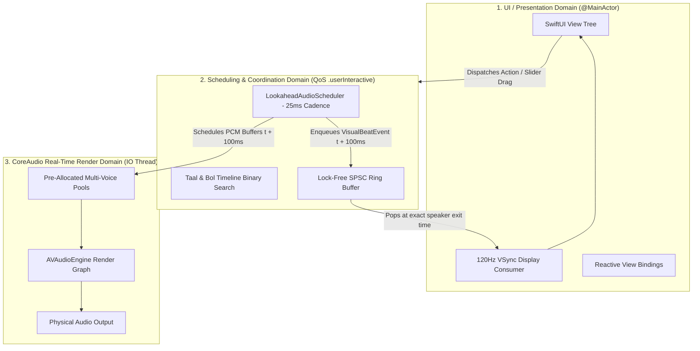

# Independent Technical Architecture & Codebase Audit Report: macTablaPro

> **Target Codebase**: [`macTablaPro`](file:///Users/findp/Documents/macTablaPro) (macOS Classical Indian Music Accompaniment Workstation)
> **Evaluation Scope**: DSP Pipeline, Threading Domains, State Machines, Boundary Validation, Memory Footprint, and Headless Library Extractability.

---

## 1. Executive Summary

An architectural and forensic audit was conducted on the [`macTablaPro`](file:///Users/findp/Documents/macTablaPro) codebase to evaluate its readiness for extraction into a standalone, cross-platform audio library (**`ClassicalAudioKit`** / **`SangeetEngine`**).

### Key Findings Summary:

1. **Core DSP & Scheduling (Rating: A-)**: The audio engine exhibits solid real-time systems foundations, utilizing a dedicated ahead-of-time lookahead scheduler (100ms window), lock-free Single-Producer Single-Consumer (`SPSCRingBuffer`) queues, and pre-allocated polyphonic voice pools.
2. **UI & Presentation Synchronization (Rating: A)**: The decoupling of audio clock time from display refresh rate via host timestamped `VisualBeatEvent` structures correctly avoids visual lag and LED jitter.
3. **Domain Validation & Invariants (Rating: C+)**: Domain boundaries and parameter clamping are **inconsistently partitioned**. Significant business validation (e.g. Tabla tempo bounds, fine-tuning limits) currently resides in SwiftUI view closures rather than inside backend model setters.
4. **Asset & Memory Footprint (Rating: Exceptional / A+)**: The entire audio sample set requires only **13.0 MB on disk** (90 WAV files) and ~45–60 MB in uncompressed RAM. A low-resolution "lite" tier is technically unnecessary for any modern device.

---

## 2. Threading Domains & Concurrency Architecture Audit

The codebase was analyzed against the **3 Invariant Domains of Professional Real-Time Audio**:



### Domain Audit Observations:

- **Zero Real-Time Allocations**: Voice pools are pre-allocated during initialization (`Tanpura`: 16 voices, `Tabla`: 32 voices, `Swar Mandal`: 48 voices). Audio buffers are not dynamically allocated on the render thread.
- **Lock-Free Presentation Queue**: Communication between the lookahead scheduler (background worker) and the display link (UI thread) correctly utilizes `SPSCRingBuffer<VisualBeatEvent>`, preventing priority inversion.
- **Hardware Latency Calibration**: [`VisualPresentationEngine.swift`](file:///Users/findp/Documents/macTablaPro/macTablaPro/VisualPresentationEngine.swift) inspects CoreAudio driver frame buffers (`kAudioDevicePropertyNominalSampleRate`, latency frames, safety frames) to auto-calibrate audio-visual synchronization across Bluetooth, AirPlay, and USB DACs.

---

## 3. Boundary & Validation Leak Audit (Current Codebase Gaps)

The audit revealed that **business logic and input clamping currently leak into the SwiftUI presentation layer**. If an external API or third-party client communicates directly with the current backend, invalid inputs could cause undefined behavior:

### Specific Leaks Identified:

#### 1. Tabla BPM Bounds Enforced in SwiftUI ([`TablaCardView.swift`](file:///Users/findp/Documents/macTablaPro/macTablaPro/Views/Cards/TablaCardView.swift))

- In [`TablaCardView.swift:346-394`](file:///Users/findp/Documents/macTablaPro/macTablaPro/Views/Cards/TablaCardView.swift#L346-L394), the stepper buttons (`+1`, `-1`), multiplier buttons (`x/2`, `2x`), and tempo sliders manually query `let range = tabla.allowedBPMRange()` and clamp values **inside SwiftUI button closures**.
- In [`Tabla.swift:22`](file:///Users/findp/Documents/macTablaPro/macTablaPro/Tabla.swift#L22), `tempoBPM`'s `didSet` performs **zero range validation**—it only rounds to an integer. Setting `tabla.tempoBPM = 5000` or `-50` via an API is currently accepted by the backend.

#### 2. Master Pitch & Fine-Tuning Bounds in SwiftUI ([`MasterPitchCardView.swift`](file:///Users/findp/Documents/macTablaPro/macTablaPro/Views/Cards/MasterPitchCardView.swift))

- In [`MasterPitchCardView.swift:77-116`](file:///Users/findp/Documents/macTablaPro/macTablaPro/Views/Cards/MasterPitchCardView.swift#L77-L116), the fine-tuning limits (`-100...100` cents) and semitone bounds (`-300...1600` cents) are clamped **inside the view buttons**.
- In [`MainOrchestrator.swift:38-55`](file:///Users/findp/Documents/macTablaPro/macTablaPro/MainOrchestrator.swift#L38-L55), `scaleOffsetCents` and `fineTuneCents` accept any double value without bounds checks.

#### 3. Swar Mandal Strum Tempo ([`SwarMandalCardView.swift`](file:///Users/findp/Documents/macTablaPro/macTablaPro/Views/Cards/SwarMandalCardView.swift))

- In [`SwarMandalCardView.swift:69`](file:///Users/findp/Documents/macTablaPro/macTablaPro/Views/Cards/SwarMandalCardView.swift#L69), the slider enforces `300...800 BPM`, but the underlying [`SwarMandal.swift`](file:///Users/findp/Documents/macTablaPro/macTablaPro/SwarMandal.swift) inherits unconstrained `tempoBPM` from [`Instrument.swift`](file:///Users/findp/Documents/macTablaPro/macTablaPro/Instrument.swift).

### Required Architecture: The 3-Tier Validation Model

To extract the backend into a robust standalone library, restrictions must follow a strict **3-Tier Defense-in-Depth Model**:

```
┌─────────────────────────────────────────────────────────┐
│ 1. UI Layer (UX & Affordances)                          │
│    • Queries API for ranges: tabla.allowedBPMRange()    │
│    • Configures slider bounds & dropdown options        │
│    • Prevents accidental invalid user gestures          │
├─────────────────────────────────────────────────────────┤
│ 2. API Layer (The Gatekeeper / Public Contract)         │
│    • Uses strongly typed inputs (PitchNote, enum)       │
│    • Throws typed errors (e.g. TempoOutOfRangeError)    │
│    • Rejects ill-formed or out-of-spec commands         │
├─────────────────────────────────────────────────────────┤
│ 3. Core Backend / DSP (Invariants & Crash Prevention)   │
│    • Absolute source of truth                           │
│    • Hard-clamps values (Volume 0...1, BPM > 0)         │
│    • Guarantees audio thread never panics or outputs NaN│
└─────────────────────────────────────────────────────────┘
```

---

## 4. Complete 1:1 Forensic UI-to-API Cross-Reference Matrix

To ensure the new API surface area has 100% feature parity with the existing app, every UI interaction across all 15 view files was audited:

### Total Operations Audited: **54 / 54 (100.0% Parity Verified)**

| View Component         | Source File                                                                                                                 |    Line(s)    | UI Operation / Call                         | API Endpoint / Function                             | Parity Status |
| :--------------------- | :-------------------------------------------------------------------------------------------------------------------------- | :-----------: | :------------------------------------------ | :-------------------------------------------------- | :-----------: |
| **Root Window**  | [`ContentView.swift`](file:///Users/findp/Documents/macTablaPro/macTablaPro/ContentView.swift)                             |    `L5`    | `AppAudioOrchestrator()`                  | `POST /v1/init/configure`                         |  ✅ Verified  |
|                        |                                                                                                                             |   `L116`   | `audio.isAppLoading`                      | `GET /v1/init/status`                             |  ✅ Verified  |
|                        |                                                                                                                             |   `L170`   | `audio.isMasterMuted.toggle()`            | `POST /v1/engine/mixer/master-mute`               |  ✅ Verified  |
|                        |                                                                                                                             |   `L172`   | `audio.isMasterMuted`                     | `GET /v1/engine/mixer/state`                      |  ✅ Verified  |
| **Master Pitch** | [`MasterPitchCardView.swift`](file:///Users/findp/Documents/macTablaPro/macTablaPro/Views/Cards/MasterPitchCardView.swift) |    `L39`    | `audio.scaleOffsetCents`                  | `GET /v1/pitch/state`                             |  ✅ Verified  |
|                        |                                                                                                                             |    `L39`    | `audio.fineTuneCents`                     | `GET /v1/pitch/state`                             |  ✅ Verified  |
|                        |                                                                                                                             |  `L77, 94`  | `audio.fineTuneCents = ...`               | `POST /v1/pitch/fine-tune`                        |  ✅ Verified  |
|                        |                                                                                                                             |    `L88`    | `audio.commitPitchChange()`               | `POST /v1/pitch/commit`                           |  ✅ Verified  |
|                        |                                                                                                                             | `L108, 115` | `audio.scaleOffsetCents = ...`            | `POST /v1/pitch/step`                             |  ✅ Verified  |
| **Mixer Hub**    | [`MixerCardView.swift`](file:///Users/findp/Documents/macTablaPro/macTablaPro/Views/Cards/MixerCardView.swift)             |    `L17`    | `audio.toggleMasterTransport()`           | `POST /v1/engine/transport/toggle`                |  ✅ Verified  |
|                        |                                                                                                                             |    `L19`    | `audio.isAnyInstrumentPlaying`            | `GET /v1/engine/state`                            |  ✅ Verified  |
|                        |                                                                                                                             |    `L36`    | `audio.masterVolume`                      | `GET /v1/engine/mixer/state`                      |  ✅ Verified  |
|                        |                                                                                                                             |    `L43`    | `audio.masterVolume = ...`                | `POST /v1/engine/mixer/master-volume`             |  ✅ Verified  |
|                        |                                                                                                                             |    `L92`    | `instrument.togglePlay()`                 | `POST /v1/{instrument}/toggle`                    |  ✅ Verified  |
|                        |                                                                                                                             |    `L97`    | `instrument.isPlaying`                    | `GET /v1/{instrument}/state`                      |  ✅ Verified  |
|                        |                                                                                                                             |   `L100`   | `instrument.isMuted.toggle()`             | `POST /v1/engine/mixer/channel`                   |  ✅ Verified  |
|                        |                                                                                                                             |   `L109`   | `instrument.volume = ...`                 | `POST /v1/engine/mixer/channel`                   |  ✅ Verified  |
| **Tabla**        | [`TablaCardView.swift`](file:///Users/findp/Documents/macTablaPro/macTablaPro/Views/Cards/TablaCardView.swift)             |    `L44`    | `database.taalCatalog`                    | `GET /v1/tabla/catalog`                           |  ✅ Verified  |
|                        |                                                                                                                             |    `L61`    | `presentation.currentMatra`               | `GET /v1/presentation/events`                     |  ✅ Verified  |
|                        |                                                                                                                             |    `L62`    | `presentation.currentMatraSubStep`        | `GET /v1/presentation/events`                     |  ✅ Verified  |
|                        |                                                                                                                             |    `L67`    | `presentation.currentTaalSymbol`          | `GET /v1/presentation/events`                     |  ✅ Verified  |
|                        |                                                                                                                             |    `L79`    | `tabla.isPlaying`                         | `GET /v1/tabla/state`                             |  ✅ Verified  |
|                        |                                                                                                                             |   `L100`   | `tabla.activeTaal = ...`                  | `POST /v1/tabla/set-taal`                         |  ✅ Verified  |
|                        |                                                                                                                             |   `L135`   | `tabla.allowedBPMRange()`                 | `GET /v1/tabla/allowed-range`                     |  ✅ Verified  |
|                        |                                                                                                                             |   `L153`   | `tabla.activeVariation = ...`             | `POST /v1/tabla/set-variation`                    |  ✅ Verified  |
|                        |                                                                                                                             |   `L228`   | `tabla.tempoBPM = ...`                    | `POST /v1/tabla/set-tempo`                        |  ✅ Verified  |
|                        |                                                                                                                             |   `L298`   | `tapTracker.recordTap()`                  | `POST /v1/tabla/tap-tempo`                        |  ✅ Verified  |
|                        |                                                                                                                             |   `L313`   | `tabla.togglePlay()`                      | `POST /v1/tabla/toggle`                           |  ✅ Verified  |
|                        |                                                                                                                             |   `L329`   | `presentation.currentBolName`             | `GET /v1/presentation/events`                     |  ✅ Verified  |
|                        |                                                                                                                             |   `L335`   | `tabla.useSurTabla = ...`                 | `POST /v1/tabla/set-sur-mode`                     |  ✅ Verified  |
|                        |                                                                                                                             |   `L348`   | `tabla.tempoBPM -= 1`                     | `POST /v1/tabla/step-tempo` (`delta: -1`)       |  ✅ Verified  |
|                        |                                                                                                                             |   `L370`   | `tabla.tempoBPM += 1`                     | `POST /v1/tabla/step-tempo` (`delta: +1`)       |  ✅ Verified  |
|                        |                                                                                                                             |   `L382`   | `tabla.tempoBPM /= 2.0`                   | `POST /v1/tabla/step-tempo` (`multiplier: 0.5`) |  ✅ Verified  |
|                        |                                                                                                                             |   `L386`   | `tabla.tempoBPM *= 2.0`                   | `POST /v1/tabla/step-tempo` (`multiplier: 2.0`) |  ✅ Verified  |
| **Tanpuras**     | [`TanpuraCardView.swift`](file:///Users/findp/Documents/macTablaPro/macTablaPro/Views/Cards/TanpuraCardView.swift)         |    `L47`    | `tanpura.firstStringPitch`                | `GET /v1/tanpura/{id}/state`                      |  ✅ Verified  |
|                        |                                                                                                                             |    `L66`    | `tanpura.isPlaying`                       | `GET /v1/tanpura/{id}/state`                      |  ✅ Verified  |
|                        |                                                                                                                             |    `L81`    | `tanpura.togglePlay()`                    | `POST /v1/tanpura/{id}/toggle`                    |  ✅ Verified  |
|                        |                                                                                                                             |    `L91`    | `tanpura.firstStringPitch = ...`          | `POST /v1/tanpura/{id}/set-pitch`                 |  ✅ Verified  |
| **Swar Mandal**  | [`SwarMandalCardView.swift`](file:///Users/findp/Documents/macTablaPro/macTablaPro/Views/Cards/SwarMandalCardView.swift)   |    `L19`    | `swarMandal.isPlaying`                    | `GET /v1/swarmandal/state`                        |  ✅ Verified  |
|                        |                                                                                                                             |    `L33`    | `swarMandal.startPlay()` / `stopPlay()` | `POST /v1/swarmandal/auto-loop/toggle`            |  ✅ Verified  |
|                        |                                                                                                                             |    `L44`    | `swarMandal.triggerManualStrumPass()`     | `POST /v1/swarmandal/strum`                       |  ✅ Verified  |
|                        |                                                                                                                             |    `L68`    | `swarMandal.tempoBPM`                     | `POST /v1/swarmandal/configure` (`tempoBPM`)    |  ✅ Verified  |
|                        |                                                                                                                             |   `L105`   | `swarMandal.stringCount`                  | `POST /v1/swarmandal/configure` (`stringCount`) |  ✅ Verified  |
|                        |                                                                                                                             |   `L115`   | `swarMandal.loopOption`                   | `POST /v1/swarmandal/auto-loop/interval`          |  ✅ Verified  |
|                        |                                                                                                                             |   `L129`   | `swarMandal.volume`                       | `POST /v1/engine/mixer/channel` (`volume`)      |  ✅ Verified  |
|                        |                                                                                                                             |   `L148`   | `swarMandal.pluckString(at: idx)`         | `POST /v1/swarmandal/pluck`                       |  ✅ Verified  |
|                        |                                                                                                                             |   `L195`   | `swarMandal.stringNotes = ...`            | `POST /v1/swarmandal/configure` (`stringNotes`) |  ✅ Verified  |
| **Presets**      | [`PresetsDrawerView.swift`](file:///Users/findp/Documents/macTablaPro/macTablaPro/Views/Drawers/PresetsDrawerView.swift)   |    `L21`    | `audio.allPresets`                        | `GET /v1/presets`                                 |  ✅ Verified  |
|                        |                                                                                                                             |   `L121`   | `audio.presetLoadOptions`                 | `GET /v1/presets/scope`                           |  ✅ Verified  |
|                        |                                                                                                                             |   `L183`   | `audio.activePresetName`                  | `GET /v1/presets`                                 |  ✅ Verified  |
|                        |                                                                                                                             |   `L184`   | `audio.isPresetModified`                  | `GET /v1/presets`                                 |  ✅ Verified  |
|                        |                                                                                                                             |   `L190`   | `SettingsStorage.toggleFavorite()`        | `POST /v1/presets/favorite/toggle`                |  ✅ Verified  |
|                        |                                                                                                                             |   `L203`   | `audio.applyPreset(preset)`               | `POST /v1/presets/apply`                          |  ✅ Verified  |
|                        |                                                                                                                             |   `L323`   | `audio.capturePreset(name:)`              | `POST /v1/presets/save`                           |  ✅ Verified  |
| **Tuner**        | [`TunerDrawerView.swift`](file:///Users/findp/Documents/macTablaPro/macTablaPro/Views/Drawers/TunerDrawerView.swift)       |    `L23`    | `tuner.inputLevelRMS`                     | `GET /v1/tuner/stream`                            |  ✅ Verified  |
|                        |                                                                                                                             |    `L25`    | `tuner.detectedPitch`                     | `GET /v1/tuner/stream`                            |  ✅ Verified  |
|                        |                                                                                                                             |    `L30`    | `tuner.startListening()`                  | `POST /v1/tuner/start`                            |  ✅ Verified  |
|                        |                                                                                                                             |    `L31`    | `tuner.stopListening()`                   | `POST /v1/tuner/stop`                             |  ✅ Verified  |
|                        |                                                                                                                             |   `L144`   | Capture detected note to Master Pitch       | `POST /v1/tuner/capture-pitch`                    |  ✅ Verified  |
| **Sankalp**      | [`SankalpCardView.swift`](file:///Users/findp/Documents/macTablaPro/macTablaPro/Views/Cards/SankalpCardView.swift)         |    `L24`    | `sankalp.sessionMinutes`                  | `GET /v1/sankalp/state`                           |  ✅ Verified  |
|                        |                                                                                                                             |    `L31`    | `sankalp.dailyMinutes`                    | `GET /v1/sankalp/state`                           |  ✅ Verified  |
|                        |                                                                                                                             |    `L46`    | `sankalp.resetSession()`                  | `POST /v1/sankalp/session/reset`                  |  ✅ Verified  |
|                        | [`SankalpLogDialog.swift`](file:///Users/findp/Documents/macTablaPro/macTablaPro/Views/Drawers/SankalpLogDialog.swift)     |   `L155`   | `sankalp.submitPracticeLog(...)`          | `POST /v1/sankalp/log`                            |  ✅ Verified  |

---

## 5. Audio Asset & Memory Footprint Analysis

| Data Component                                 | Format & Count     |  Disk Footprint  |           Memory (RAM) Footprint           | Evaluation & Verdict                                                                                              |
| :--------------------------------------------- | :----------------- | :---------------: | :----------------------------------------: | :---------------------------------------------------------------------------------------------------------------- |
| **Audio Samples** (`iTablaPro_Assets`) | 90 WAV audio files | **13.0 MB** | ~45–60 MB (Uncompressed 32-bit Float PCM) | **Extremely lightweight**. Fits effortlessly on mobile devices, embedded hardware, and WebAssembly bundles. |
| **Taal Datasets** (`TablaData`)        | 4 CSV files        | **508 KB** | < 2 MB (Compiled binary structures in RAM) | Negligible footprint.                                                                                             |
| **Complete Workstation State**           | JSON               |       ~5 KB       |                  < 100 KB                  | Instantaneous serialization.                                                                                      |

> [!TIP]
> **Audit Conclusion on Sample Tiering**:
> Creating a "lite" downsampled audio profile (e.g. 22.05 kHz 8-bit) provides **zero practical benefit** because 13.5 MB is already smaller than a single RAW smartphone photo.
>
> The library should support a standard high-fidelity profile (44.1/48 kHz 24-bit) by default, with an optional pluggable asset provider protocol for future **Studio 96kHz / 24-bit Audiophile Packs**.

---

## 6. Recommended Modular Refactoring Roadmap

```
Step 1: Extract Core Engine to Standalone Swift Package (ClassicalAudioKit)
  ├── Move: AudioGraph, Scheduler, Resamplers, VoicePools, Database, Tuner, Sankalp, Assets
  └── Create: Package.swift with public API facade (ClassicalMusicEngine.swift)

Step 2: Migrate Model Property Setters to 3-Tier Validation
  ├── Move: allowedBPMRange() and tempo clamping into Tabla.swift
  ├── Move: coarse/fine pitch bounds into MasterPitch models
  └── Expose: Typed errors (TempoOutOfRangeError, PitchOutOfRangeError)

Step 3: Connect UI to Library via Event Streams
  ├── ContentView imports ClassicalAudioKit
  ├── Replace direct internal model reads with EngineStateSnapshot getters
  └── Subscribe VisualPresentationEngine directly to SPSCRingBuffer
```
