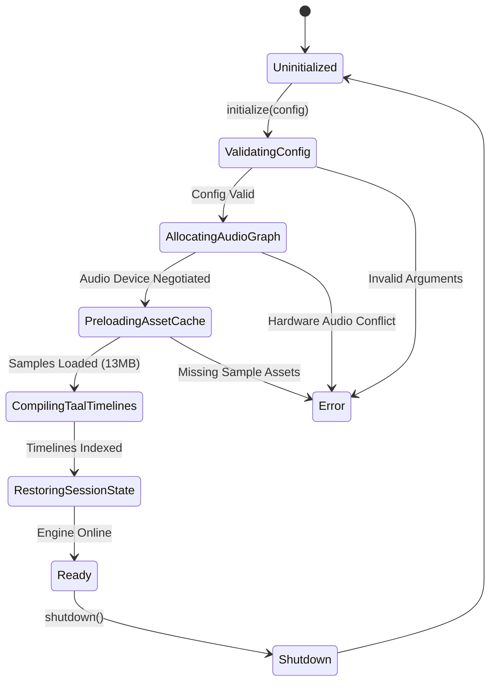
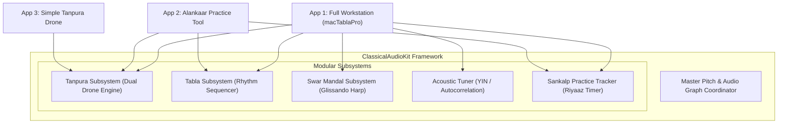

# Universal Classical Music Engine: Core Architecture & Implementation Specification

> **Specification Version**: `1.0.0-draft`  
> **Target Audiences**: Audio Systems Engineers, Library Authors, C++ / JUCE / Rust / Swift / WebAssembly Developers  
> **Source Base**: [`macTablaPro`](file:///Users/findp/Documents/macTablaPro)

---

## 1. Engine Initialization & Boot Lifecycle

The engine is architected around a strict **Asynchronous 6-Phase Initialization Pipeline**. This guarantees zero audio glitches, zero UI thread blocking during app launch, and dynamic resource scaling based on which modules the client requests.



### The 6 Initialization Phases

#### Phase 1: Configuration Validation & Module Selection
The host app declares which sub-engines to activate:
```swift
public struct EngineConfiguration: Sendable {
    public var enabledModules: Set<EngineModule> = [.tanpura, .tabla, .swarMandal, .sankalp, .tuner, .presets]
    public var preferredSampleRate: Double = 44100.0
    public var bufferFrameSize: Int = 512
    public var customAssetPath: URL? = nil
    public var autoRestoreSession: Bool = true
}
```
* **Optimization Rule**: If the client is building an *Alankaar Practice Tool* and requests only `[.tanpura, .tabla, .sankalp]`, the engine **skips Swar Mandal and Tuner allocations**, saving ~20 MB of RAM and eliminating unnecessary audio capture sessions.

#### Phase 2: Audio Device Negotiation & Graph Allocation
* Queries output hardware for native sample rate ($44.1\text{ kHz}$ / $48\text{ kHz}$) and frame buffer size ($256$ / $512$ frames).
* Creates the Master Mixer bus and attaches dedicated sub-mixers for each enabled instrument.
* Pre-allocates polyphonic voice pools:
  - **Tanpura Pool**: 16 voices (Stereo interleaved PCM).
  - **Tabla Pool**: 32 voices (Allows multi-finger compound rolls and ringing sustain without voice stealing).
  - **Swar Mandal Pool**: 48 voices (Handles rapid 36-string glissandos with natural reverberant decay).

#### Phase 3: Sample Asset Cache Loading
* Reads all required WAV audio assets into an immutable in-memory cache:
  - `iTablaPro_Assets` (~13.0 MB on disk, ~45–60 MB uncompressed 32-bit float PCM in RAM).
* Audio buffers are marked read-only and shared across voice pools without memory copies.

#### Phase 4: Taal Database Compilation & Timeline Indexing
* Parses `Taal.csv`, `TaalBols.csv`, and `TaalVariations.csv` (~508 KB).
* Pre-computes and compiles timelines for all 16+ Taals across all 5 Tempo Tiers into indexed binary structures (`[TablaStrokeEvent]`) sorted by `startBeatFraction`.
* Enables $O(\log N)$ binary search for stroke lookup during live playback.

#### Phase 5: State & Session Restoration
* Asynchronously loads persisted preferences from disk (or defaults to standard `C#3` Sa, 100 BPM Teentaal, 60 BPM Tanpura).
* Initializes all instrument transport states to `isPlaying = false`.

#### Phase 6: Engine Ready Event
* Transitions state to `EngineState.ready` and opens the public API dispatch pipeline.

---

## 2. Platform-Agnostic Audio Architecture (JUCE / C++ / WASM / Rust)

To implement this engine in **C++, JUCE, WebAssembly, or Rust**, map the Apple CoreAudio abstractions to the universal DSP patterns below:

### A. Polyphonic Voice Pool Pattern (Voice Stealing & Mixing)

```cpp
// Platform-Agnostic C++ Voice Structure
struct AudioVoice {
    const float* sampleBuffer = nullptr; // Pointer to loaded PCM data in RAM
    int totalSampleFrames = 0;
    double currentSamplePosition = 0.0;
    double playbackRateRatio = 1.0;     // Pitch shift: 2^(cents / 1200.0)
    float volume = 1.0f;
    bool isBusy = false;

    void renderNextBlock(float* outputBuffer, int numFrames) {
        if (!isBusy || sampleBuffer == nullptr) return;

        for (int i = 0; i < numFrames; ++i) {
            int indexInt = static_cast<int>(currentSamplePosition);
            if (indexInt >= totalSampleFrames - 1) {
                isBusy = false;
                break;
            }
            // Linear or Hermite interpolation for smooth microtonal pitch
            float frac = static_cast<float>(currentSamplePosition - indexInt);
            float sample = sampleBuffer[indexInt] * (1.0f - frac) + sampleBuffer[indexInt + 1] * frac;
            
            outputBuffer[i] += sample * volume;
            currentSamplePosition += playbackRateRatio;
        }
    }
};
```

---

### B. Lookahead Audio Scheduler & Clock Decoupling

The sequencer runs on a high-priority worker thread decoupled from both the UI and the real-time audio DAC interrupt:

```
┌─────────────────────────────────────────────────────────────┐
│ 1. Sequencer Thread (Lookahead Worker, wakes every 25ms)    │
│    • Looks ahead by Δt = 100ms into the future.             │
│    • Evaluates active timeline: nextEvent(atOrAfterBeat).    │
│    • Pushes audio buffers to voice pool with host timestamp.│
│    • Pushes VisualBeatEvent into SPSC Ring Buffer.          │
├─────────────────────────────────────────────────────────────┤
│ 2. Audio Render Thread (Hardware Interrupt / processBlock)  │
│    • Reads scheduled voices and mixes PCM into DAC buffer.  │
│    • Guarantees ZERO allocations, ZERO locks, ZERO file I/O.│
├─────────────────────────────────────────────────────────────┤
│ 3. UI Display Thread (VSync Consumer ~60Hz/120Hz)           │
│    • Consumes SPSC Ring Buffer when current_time >= event_time.
│    • Updates visual LEDs, bols, and matra counters cleanly. │
└─────────────────────────────────────────────────────────────┘
```

---

### C. Lock-Free Single-Producer Single-Consumer (SPSC) Ring Buffer

```cpp
template <typename T, size_t Capacity>
class SPSCRingBuffer {
    T buffer[Capacity];
    std::atomic<size_t> head{0};
    std::atomic<size_t> tail{0};

public:
    bool push(const T& item) {
        size_t currentHead = head.load(std::memory_order_relaxed);
        size_t currentTail = tail.load(std::memory_order_acquire);
        if ((currentHead + 1) % Capacity == currentTail) return false; // Full
        
        buffer[currentHead] = item;
        head.store((currentHead + 1) % Capacity, std::memory_order_release);
        return true;
    }

    bool pop(T& item) {
        size_t currentTail = tail.load(std::memory_order_relaxed);
        size_t currentHead = head.load(std::memory_order_acquire);
        if (currentTail == currentHead) return false; // Empty
        
        item = buffer[currentTail];
        tail.store((currentTail + 1) % Capacity, std::memory_order_release);
        return true;
    }
};
```

---

## 3. Subsystem Modularization & Component Reuse

Each instrument is a completely standalone component. Applications instantiate only the components they require:



### Concrete Swift Consumption Example: Alankaar App
```swift
import ClassicalAudioKit

@MainActor
final class AlankaarAppModel: ObservableObject {
    let engine: ClassicalMusicEngine
    
    init() {
        // Initialize strictly Tanpura, Tabla, and Sankalp
        self.engine = try! ClassicalMusicEngine(
            configuration: EngineConfiguration(
                enabledModules: [.tanpura, .tabla, .sankalp],
                preferredSampleRate: 44100.0
            )
        )
    }
    
    func startPractice(raagPitch: PitchNote, taalName: String, bpm: Double) async {
        // 1. Set Sa
        await engine.setMasterPitch(saNote: raagPitch)
        
        // 2. Configure Tanpuras (Pa-Sa drone)
        await engine.tanpura1.update(firstString: .pa, tempoBPM: 60)
        await engine.tanpura2.update(firstString: .sa, tempoBPM: 60)
        await engine.tanpura1.play()
        await engine.tanpura2.play()
        
        // 3. Configure Tabla
        try? await engine.tabla.update(taal: taalName, variation: "Pro Default", tempoBPM: bpm)
        await engine.tabla.play()
        
        // 4. Sankalp practice tracker automatically begins timing practice!
    }
}
```
